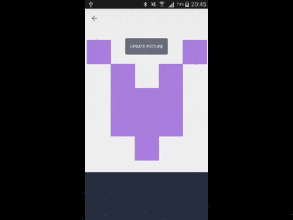

# AndroidImageZoomCrop
Android view library for crop images like in Twitter and Facebook.
Should be good for cropping cover photos.





## Getting Started
**1)** In your `build.gradle`:

```gradle
repositories {
  jcenter()
  maven { url "https://jitpack.io" }
}
dependencies {
  compile 'com.github.techery:AndroidImageZoomCrop::{jitpack-release}'
}
```

**2)** In code
When you know file path
```java
    
    String filePath = "";
    Crop.prepare(filPath).startFrom(activity|fragment);
```
Then just get result in `onActivityResult`
```java
    protected void onActivityResult(int requestCode, int resultCode, Intent result) {
        Crop.onActivityResult(requestCode, resultCode, result, callback)
    }

```
where `callback` is
```java
    new Crop.ImageCropListener() {
      @Override public void onImageCropped(String filePath, String error) {
        Log.d(TAG, "Cropped file path " + filePath)            
      }
    }
```

**3)**Custom config

You can set custom ratio of crop surface
```java
    Crop.prepare(mFileTemp.getPath()).ratio(3,1).startFrom(this);
```

## Credits
This library is just a full copy of  [AndroidImageZoomCrop](https://github.com/ozeetee/AndroidImageZoomCrop), but prepared for universal use

## License

    Copyright (c) 2015 Techery

    Licensed under the Apache License, Version 2.0 (the "License");
    you may not use this file except in compliance with the License.
    You may obtain a copy of the License at

       http://www.apache.org/licenses/LICENSE-2.0

    Unless required by applicable law or agreed to in writing, software
    distributed under the License is distributed on an "AS IS" BASIS,
    WITHOUT WARRANTIES OR CONDITIONS OF ANY KIND, either express or implied.
    See the License for the specific language governing permissions and
    limitations under the License.


